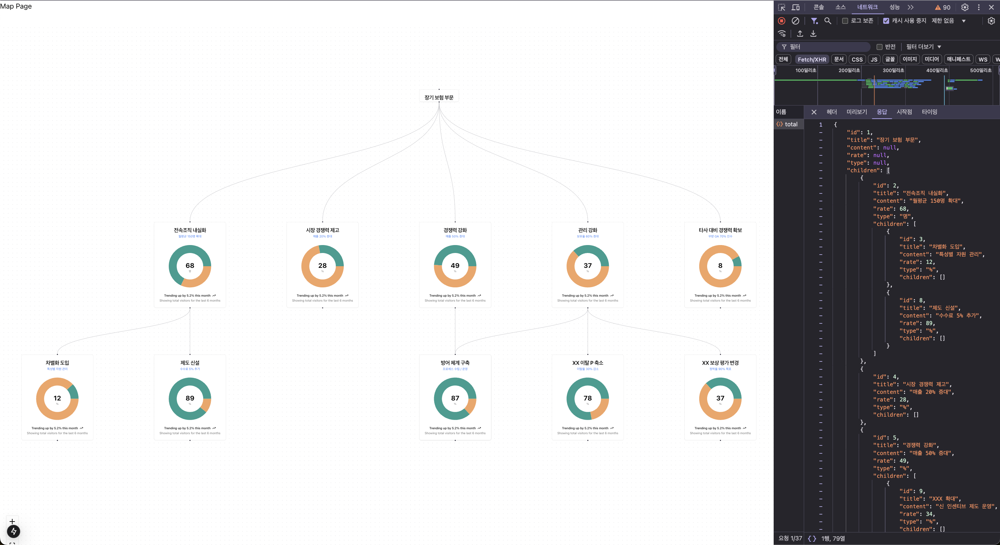
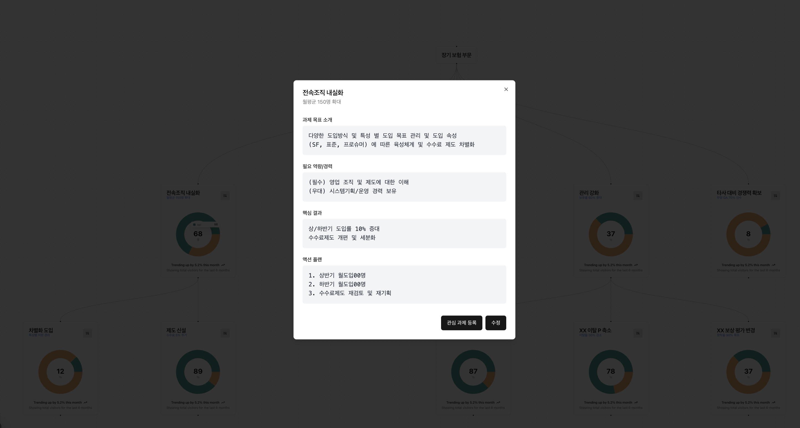
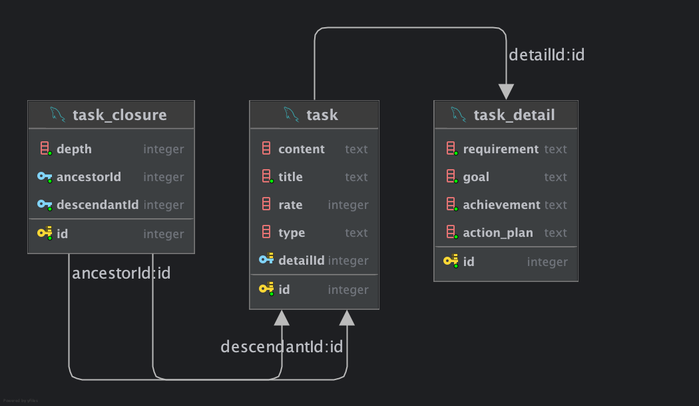

# 1. Next.js + Nest.js 프레임워크 기반 모델
### 1-1. Introduction
- 기술 스택
  - 프레임워크
    - FE: Next.js
    - BE: Nest.js
    - ORM: TypeORM
  - 라이브러리
    - Component UI: shadcn https://ui.shadcn.com/
    - Map: reactflow https://reactflow.dev/
  - Database: PostgreSQL
- Repository: https://github.com/carefreelife98/FlowTest/tree/main/okr 

### 1-2. Map 예시 페이지
#### 1-2-1. Task Depth 구현

- Closure Table 활용한 무제한 Depth 의 Task 형태 구현
  - table: task, task_closure
  - 각 task는 map 상의 각 노드에 노출될 최소한의 데이터를 가짐
  - task_closure 테이블에는 각 task 의 부모 task, 자식 task 및 자기 자신과의 관계와 Depth 를 저장.
  
#### 1-2-2. Task Detail 구현

- task 와 task_detail 을 구분한 이유
  - table: task, task_detail
  - task 에는 map 에 노출시킬 최소한의 데이터만을 저장.
    - map 을 그리기 위한 전체 트리 구조 API 호출 시의 성능을 위함.
    - 각 task 클릭 시 호출하는 API 는 해당 task 와 1:1 매핑된 task_detail 에서 상세 정보를 제공.

#### 1-2-1. Map Prototype ERD

